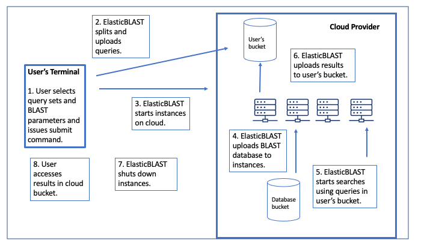

..                           PUBLIC DOMAIN NOTICE
..              National Center for Biotechnology Information
..  
.. This software is a "United States Government Work" under the
.. terms of the United States Copyright Act.  It was written as part of
.. the authors' official duties as United States Government employees and
.. thus cannot be copyrighted.  This software is freely available
.. to the public for use.  The National Library of Medicine and the U.S.
.. Government have not placed any restriction on its use or reproduction.
..   
.. Although all reasonable efforts have been taken to ensure the accuracy
.. and reliability of the software and data, the NLM and the U.S.
.. Government do not and cannot warrant the performance or results that
.. may be obtained by using this software or data.  The NLM and the U.S.
.. Government disclaim all warranties, express or implied, including
.. warranties of performance, merchantability or fitness for any particular
.. purpose.
..   
.. Please cite NCBI in any work or product based on this material.

.. _overview:

Overview
========

**What is BLAST?**

The Basic Local Alignment Search Tool (BLAST) finds regions of local similarity between sequences. The program compares nucleotide or protein sequences to sequence databases and calculates the statistical significance of matches. BLAST can be used to infer functional and evolutionary relationships between sequences as well as help identify members of gene families.

Introduced in 2009, BLAST+ is a command line application. For a full description of the features and capabilities of BLAST+, please refer to the `BLAST Command Line Applications User Manual <https://www.ncbi.nlm.nih.gov/books/NBK279690/>`_.

BLAST was developed and is supported by the `National Center for Biotechnology Information <https://www.ncbi.nlm.nih.gov/>`_, part of the National Library of Medicine, at the US National Institutes of Health.

**What is Cloud Computing?**

Cloud computing offers the ability to use scalable, on-demand and elastic computational resources for nominal cost. The ability to scale resources across multiple machines (called "instances" here) allows more work to be done in a given amount of time. Cloud computing also offers cloud buckets to store files.  Using cloud buckets to store files is independent from instance usage and much cheaper. Therefore, once your work is completed and results copied to a cloud bucket, your instances can be stopped and you can access your results without paying to run an instance.  

The cloud concepts mentioned here are important for ElasticBLAST users.  ElasticBLAST can run on either Google Cloud Platform (GCP) or Amazon Web Services (AWS).  You can read about `GCP (Google) <https://cloud.google.com/docs/overview/>`_ and `AWS (Amazon) <https://aws.amazon.com/what-is-aws/?nc1=f_cc/>`_.

**Why use ElasticBLAST?**

ElasticBLAST distributes your searches across multiple instances.  The ability to scale resources in this way allows large numbers of queries to be searched in a shorter time than BLAST+ on a single machine.

ElasticBLAST performs many cloud configuration and management tasks for you.  It starts up instances for you, provisions
them with the BLAST software and databases, schedules the searches, and copies the BLAST results to a cloud bucket.
Finally, it shuts down all these instances when you use run the delete command.  You can start an ElasticBLAST run from
your own computer, a cloudshell, or an instance in the cloud.  We've even heard from a group that doesn't have a lot of
queries to search but is using ElasticBLAST since it performs a lot of tasks they'd have to write scripts for.

ElasticBLAST performs the searches with the BLAST+ package, and most of the BLAST+ command-line options are supported with ElasticBlast.

**How does ElasticBLAST work?**

* You provide ElasticBLAST with queries and information about your BLAST search, a cloud bucket to hold results, and any BLAST+ options you want to use.  The queries are one or more FASTA files or a list of accessions.  They can be gzipped. The BLAST database is one of the databases hosted by the NCBI at a cloud provider or a database you provide.

* ElasticBLAST breaks your queries into batches and uploads them to your cloud bucket.

* ElasticBLAST starts instances for you, provisions them with BLAST software and loads the BLAST database you requested.

* ElasticBLAST runs your batches on the instances, queuing up the work with cloud native scheduling software (Kubernetes on GCP and AWS Batch on AWS).  When the searches are done, the results are gzipped and stored in your cloud bucket.  The results are stored one file per batch, so you'll have your results in multiple files even if you started with one very large FASTA file.

* You shut down ElasticBLAST after the search is done, deleting the resources but not the results.  

* You can download the results from the cloud bucket to your local machine or leave them there for further processing in the cloud.  We also provide a script to start the search and download the results.  See :ref:`elb_submit_and_wait` for details.

To do your first ElasticBLAST run, go to the :ref:`quickstart-gcp` or the :ref:`quickstart-aws`

