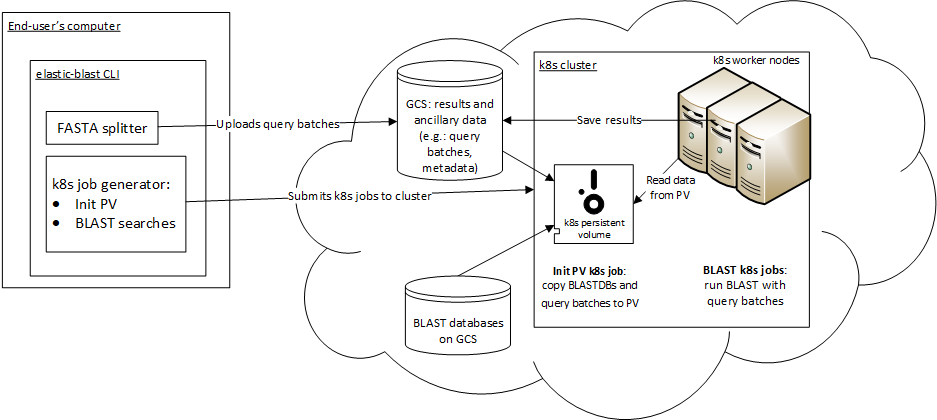

..                           PUBLIC DOMAIN NOTICE
..              National Center for Biotechnology Information
..  
.. This software is a "United States Government Work" under the
.. terms of the United States Copyright Act.  It was written as part of
.. the authors' official duties as United States Government employees and
.. thus cannot be copyrighted.  This software is freely available
.. to the public for use.  The National Library of Medicine and the U.S.
.. Government have not placed any restriction on its use or reproduction.
..   
.. Although all reasonable efforts have been taken to ensure the accuracy
.. and reliability of the software and data, the NLM and the U.S.
.. Government do not and cannot warrant the performance or results that
.. may be obtained by using this software or data.  The NLM and the U.S.
.. Government disclaim all warranties, express or implied, including
.. warranties of performance, merchantability or fitness for any particular
.. purpose.
..   
.. Please cite NCBI in any work or product based on this material.

.. _quickstart-gcp:

Quickstart for GCP
==================

Overview 
--------

In this quickstart, you will run a BLASTP (protein-protein) search with ElasticBLAST, producing tabular output that also lists taxonomic information about your matches.  

You will use Google Cloud Shell for this first ElasticBLAST run.  The Cloud Shell already has some of the needed software installed and is easy to start up.  

To start up the Cloud Shell, follow these `instructions <https://cloud.google.com/shell/docs/using-cloud-shell>`_.

Please note that the cloudshell environment is best suited for evaluating and
learning how to use ElasticBLAST. 

In order to complete this quickstart, you will need to be familiar with the GCP console, have an account at GCP, be comfortable with the command-line and editing files with a text editor.  

As you work through this quickstart, you may occasionally see a message from the Cloud Shell asking you to authorize use of GCP API's.  Simply select the "Authorize" button. 

You may also find it convenient to start a new project for this quickstart.  You can do this by clicking on your project name in the blue bar at the top of the page.  This will bring up a dialogue, and you can select "NEW PROJECT" in the top right-hand corner.

Get ElasticBLAST
----------------

Copy and paste the commands below at the CloudShell prompt to install
ElasticBLAST.

.. code-block:: bash

    [ -d .elb-venv ] && rm -fr .elb-venv
    python3 -m venv .elb-venv && source .elb-venv/bin/activate
    pip install wheel
    pip install elastic-blast=={VERSION}

Following these instructions will add ``elastic-blast`` to your ``PATH``. 

Run the two ElasticBLAST commands listed below.  If ElasticBLAST is properly installed, the first one will report the version of ElasticBLAST installed and the second one will give you the help message.

.. code-block:: bash

    elastic-blast --version
    elastic-blast --help

You may see a message about setuptools replacing distutils, but that can be safely ignored.

Set up an output bucket (if one doesn't exist)
----------------------------------------------

To run ElasticBLAST, you will need a cloud bucket to store files.  Cloud buckets are
independent from a running instance and much cheaper.  ElasticBLAST uses your cloud
bucket to stage files and also deliver your final results.

If you already have a cloud bucket named gs://elasticblast-${USER} (with ${USER} being your username),
then run the command below to verify that it exists.

.. code-block:: shell

    gsutil ls gs://elasticblast-${USER}

If your bucket exists (no error message) then you should move onto the next section.

If you do not have a bucket, then you need to make one using the command below.  

.. code-block:: shell

    gsutil mb gs://elasticblast-${USER}

Enable auto-shutdown feature
----------------------------

Please follow the instructions in :ref:`janitor`.

Configure ElasticBLAST
----------------------

You will use a configuration file to specify your input to ElasticBLAST.  Once you have written the configuration file, you'll just need to tell ElasticBLAST about it when invoked.

You will need to make the following changes to the configuration file:

#. Replace USER on the "label" line with your actual username using all lower case letters (value of ${USER}).
#. Replace USER on the "results" line with your actual username using all lower case letters (value of ${USER}).

Start by copying the configuration file shown below.  Using an editor, write this text to a new file called "BDQA.ini".  Both nano and vi are available on the Cloud Shell.

.. code-block::
    :name: minimal-config

    [cloud-provider]
    gcp-region = us-east4
    gcp-zone = us-east4-b
    gke-version = 1.24

    [cluster]
    num-nodes = 1
    labels = owner=USER
    #Uncomment next line if error "Requested disk size 3000.0G is larger than allowed." occurs.
    #pd-size = 400G

    [blast]
    program = blastp
    db = swissprot
    queries = gs://elastic-blast-samples/queries/protein/BDQA01.1.fsa_aa
    results = gs://elasticblast-USER/results/BDQA
    options = -task blastp-fast -evalue 0.01 -outfmt "7 std sskingdoms ssciname" 

If you created your results bucket with the gsutil command above, it will be as shown in the configuration file above.  

ElasticBLAST will place your results at gs://elasticblast-${USER}/results/BDQA.  For your next search, you should use a different token than BDQA or remove those results, otherwise elastic-blast will refuse to run as it would overwrite your old results.  

Since this is a small search, the  configuration file specifies one GCP instance, specified by "num-nodes", for your search.  The BLASTP program searches proteins from the BDQA WGS project (obtained from a cloud bucket) against the swissprot database.

In addition to the minimal parameters, the configuration file above includes some BLAST options.

ElasticBLAST will run your search in the us-east4 region and the us-east4-b zone.
You may modify this by following the instructions in the :ref:`configuration` section.  

See :ref:`configuration` for details on all the configuration parameters.

This search should take about 10 minutes to run and cost less than $1.  

Run ElasticBLAST
----------------

.. code-block:: bash

    elastic-blast submit --cfg BDQA.ini

The :ref:`submit` command can take a few minutes minutes as it brings up cloud resources and downloads the BLAST database.
Once it returns, you can move on to the next step.

You may see an error message about your disk size being too large ("Requested disk size 3000.0G is larger than allowed..").  In that case you should uncomment the line "pd-size = 400G" line in your config file.  That disk will be large enough for this quick-start.

If your cloud shell session disconnects, please see :ref:`cloud_shell_disconnect`.

Monitor progress
----------------
To check on the progress of the search, inspect the logfile
(``elastic-blast.log`` by default) and/or run the command below:

.. code-block:: bash

    elastic-blast status --cfg BDQA.ini

For additional details, please see :ref:`the status command documentation <status>`.

An alternate way to monitor the progress is to inspect the kubernetes pods/nodes activity:

.. code-block:: bash
    :name: kubectl-monitor

    kubectl get pods -o wide
    kubectl top pods --containers
    kubectl top nodes

The `GCP web console <https://console.cloud.google.com/kubernetes/list>`_
provides a graphical user interface to monitor your kubernetes cluster.

Once all batches have finished, you can download results as shown below.

Download results
----------------

You will find it convenient to set an environment variable for the location of your results.  You'll need to modify the command below to use the same path listed in BDQA.ini.

.. code-block:: bash

   export YOUR_RESULTS_BUCKET=gs://elasticblast-${USER}/results/BDQA

Now, use the command below to download your results from your results bucket. This command assumes you have set ${YOUR_RESULTS_BUCKET}.  If you haven't done this, simply replace ${YOUR_RESULTS_BUCKET} by the path.

.. code-block:: bash

    gsutil -qm cp ${YOUR_RESULTS_BUCKET}/*.out.gz .

Running "ls" in the Cloud Shell should list a file named "batch_000-blastp-swissprot.out.gz
".
ElasticBLAST breaks your set of queries into multiple batches and runs one search per batch.  Your results are returned with the results of each batch in a separate file.  For this small database, there is only one batch.  Larger searches will have multiple batches.

Running "ls" in the Cloud Shell should list one file named something like "batch_000-blastp-swissprot.out.gz".  

Use the commands below to decompress the results and then view with "less".

.. code-block:: bash

    gunzip batch_000-blastp-swissprot.out.gz 
    less batch_000-blastp-swissprot.out

You will see tabular output with matches to the swissprot database.  The output also includes the super-kingdom and scientific name of the database sequence found.  The queries come from a WGS study of viral metagnomes (`BDQA <https://www.ncbi.nlm.nih.gov/Traces/wgs/BDQA01>`_) so having the taxonomic information helps you to determine whether a query is really from a virus and which one.

The results for one query, GBH21753.1, are shown below.  Both matches cover most of the query and the database sequences, and both are statistically significant, as judged by the expect value.  This report lists the super-kingdom as "Viruses" in both cases. The scientific names are in the rightmost fields (scroll the window to see these).  

::

    # BLASTP 2.13.0+
    # Query: GBH21753.1 RdRp [viral metagenome]
    # Database: swissprot
    # Fields: query acc.ver, subject acc.ver, % identity, alignment length, mismatches, gap opens, q. start, q. end, s. start, s. end, evalue, bit score, subject super kingdoms, subject sci name
    # 2 hits found
    GBH21753.1      Q9INJ1.1        42.799  1236    661     21      8       1222    3       1213    0.0     894     Viruses Banna virus strain JKT-6423
    GBH21753.1      Q698V5.1        27.635  1205    766     35      62      1210    62      1216    8.43e-95        333     Viruses Eriocheir sinensis reovirus isolate 905

You can see more information on these database matches at `Q9INJ1.1 <https://www.ncbi.nlm.nih.gov/protein/Q9INJ1.1>`_ and `Q698V5.1 <https://www.ncbi.nlm.nih.gov/protein/Q698V5.1>`_

.. _elb_gcp_cleanup:

Clean up cloud resources
------------------------

ElasticBLAST works very hard to clean up resources after the BLAST search
completes or in case of failure.
It may be always prudent to run ``elastic-blast delete`` as a safety measure to prevent
accruing charges and exhausting quotas.

This step is **required** if the :ref:`janitor` is **not** enabled. Please do
not omit it, even if you ran Ctrl-C when
starting ElasticBLAST. If you do not clean up your cloud resources, you may accrue charges from
your cloud service provider or you may end up running out of available quota or
into service limits.. 
It is also recommended each time you start a new ElasticBLAST search. 

.. code-block:: bash

    elastic-blast delete --cfg BDQA.ini

The :ref:`delete` command will take a few minutes to run as it needs to manage multiple cloud resources.

You may verify that your cloud resources have been deleted by running: 

.. code-block:: bash

  gcloud container clusters list --project YOUR_GCP_PROJECT_ID --filter='status=RUNNING AND resourceLabels.billingcode=elastic-blast'
  gcloud compute disks list --project YOUR_GCP_PROJECT_ID --filter='labels.billingcode=elastic-blast'
  gcloud compute instances list --project YOUR_GCP_PROJECT_ID --filter='labels.billingcode=elastic-blast'

This will show all clusters, instances, and disks in your project (even from other users) started by ElasticBLAST.
If nothing is returned, then no clusters or instances are running and no disks are being
used. Alternatively, you can also invoke the script
``cleanup-stale-gcp-resources.py --help`` to list or clean up are any stale GCP
resources created by ElasticBLAST.

Summary
-------

You have run a BLASTP (protein-protein) search with ElasticBLAST, producing tabular output that also lists taxonomic information about your matches.  The BLAST search was selected to be quick and inexpensive to run with a query set of 548 proteins and the swissprot database.  

You used the Cloud Shell to launch your search.  The Cloud Shell has the advantage that it is easy to start up and already has the GCP SDK, python, and kubectl (used by elastic-blast to submit searches) installed.  The Cloud Shell has `limitations <https://cloud.google.com/shell/docs/limitations>`_ and you should consider other environments for further work.  ElasticBLAST can also be started from your own machine or a cloud instance you have brought up.  In that case, you will need to make sure that the :ref:`requirements <requirements>` have been met.  You should also look at :ref:`GCP Configuration <gcp_conf>` (below).

The :ref:`tutorials` page provides more details on ElasticBLAST as well as examples. 

.. _gcp_conf:

GCP Configuration
-----------------

You must be authenticated with the GCP project in the environment you are working on.
