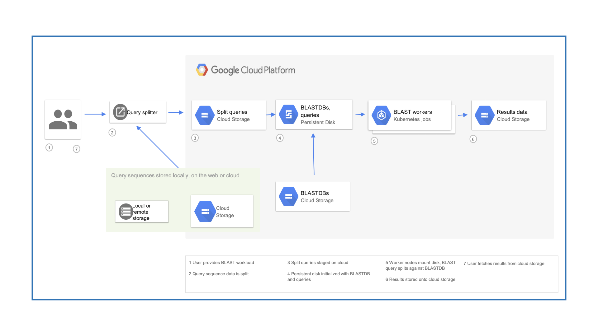

.. _quickstart:

Quickstart
==========

The Big Picture
---------------

   ElasticBLAST overview

Get ElasticBLAST
----------------

.. code-block:: shell

    # Optional: replace ${PWD} with the desired installation path
    gsutil -mq rsync -r gs://elastic-blast/release/{VERSION}/ ${PWD}
    find ${PWD} -type f ! -name "*.md5" | xargs chmod +x

The code examples below assume that ElasticBLAST was installed in the current working directory.

See version and help
--------------------

To see the version of elastic-blast you are using:

.. code-block:: shell

   ./elastic-blast --version

To see the help message:

.. code-block:: shell

   ./elastic-blast --help

Configure it
------------

The minimal configuration requires: 

#. Google Cloud Platform (GCP) parameters (:ref:`project <elb_gcp_project>`, :ref:`region <elb_gcp_region>`, and :ref:`zone <elb_gcp_zone>`),

#. :ref:`query sequences <elb_queries>` in a single file or tarball, 

#. a :ref:`GCP bucket for results <elb_results_bucket>`.  The name of this bucket must start with gs://

#. Basic BLAST parameters (:ref:`program <elb_blast_program>` and :ref:`database <elb_db>`), and
#. :ref:`elb_num_nodes` to start.

They can be provided on a standard ini configuration file, e.g.:

.. code-block::
    :name: minimal-config
    :linenos:

    [cloud-provider]
    gcp-project = ${YOUR_GCP_PROJECT_ID}
    gcp-region = us-east4   
    gcp-zone = us-east4-b

    [cluster]
    num-nodes = 3

    [blast]
    program = blastp
    db = nr
    queries = gs://elastic-blast-samples/queries/protein/BDQE01.1.fsa_aa
    results-bucket = ${YOUR_RESULTS_BUCKET}
    options = -task blastp-fast -evalue 0.01 -outfmt 7 

In addition to the minimal parameters, the configuration file above includes some BLAST options.
The search above should take about 30 minutes to run and cost less than $3.  Using :ref:`preemptible nodes<ELB_USE_PREEMPTIBLE>` can make it less expensive.

See :ref:`configuration` for details on all the configuration parameters.

Run it!
-------

.. code-block:: bash

    ./elastic-blast submit --cfg ${CONFIG_FILE} --loglevel DEBUG

The submit command can take several minutes as it brings up your cluster and downloads your BLAST database.
**NOTE**: currently you can only have **one** ElasticBLAST search running at a time.

You can also add --sync to the above command-line, in which case elastic-blast will automatically shut 
down your cluster when it's done.  In this case, it's important that your computer stays powered up and connected 
to the internet, so that elastic-blast can issue the command to delete the cluster. If you lose the network connection during the search, you will have to shut the cluster down manually (see delete command below).

If you are running `elastic-blast --sync` in a remote/shared linux server, please consider using `nohup` or a terminal multiplexer (e.g.: `screen` or `tmux`) to keep the process alive in the event of network disconnection or log out.

Monitor progress
----------------
To check on the progress of the search, inspect the logfile
(``elastic-blast.log`` by default) and/or run the command below:

.. code-block:: bash
    :name: status

    ./elastic-blast status --cfg ${CONFIG_FILE} --loglevel DEBUG

The status command will not return proper results until the submit command has finished.

An alternate way to monitor the progress is to inspect the kubernetes
pods/nodes activity:

.. code-block:: bash
    :name: kubectl-monitor

    kubectl get pods -o wide
    kubectl top pods --containers
    kubectl top nodes

The `GCP web console <https://console.cloud.google.com/kubernetes/list>`_
provides a graphical user interface to monitor your kubernetes cluster.

Problems? Search taking too long? Please see :ref:`support`.

Get results
-----------

Run the command below to download the results

.. code-block:: bash

    gsutil -qm cp ${YOUR_RESULTS_BUCKET}/*.out.gz .

Clean up
--------
This step is **critical**, please do not omit it, even if you ran Ctrl-C when
starting ElasticBLAST. If your cluster stays up, you will accrue charges from
your cloud provider.  It is also recommended each time you start a new
ElasticBLAST search. 

.. code-block:: bash

    ./elastic-blast delete --cfg ${CONFIG_FILE} --loglevel DEBUG

The delete command will take a few minutes to run as it needs to shut the cluster down.
You may verify that your cluster and disk have been deleted by running: 

.. code-block:: bash

  gcloud container clusters list --project <your-gcp-project-id>
  gcloud compute disks list --project <your-gcp-project-id>

This will show all clusters and disks in your project (even from other users).  If nothing is returned, then no clusters are running and no disks are being used.  Please see :ref:`PD_LEAK` if your cluster or disk is not properly deleted for instructions on deleting them.
